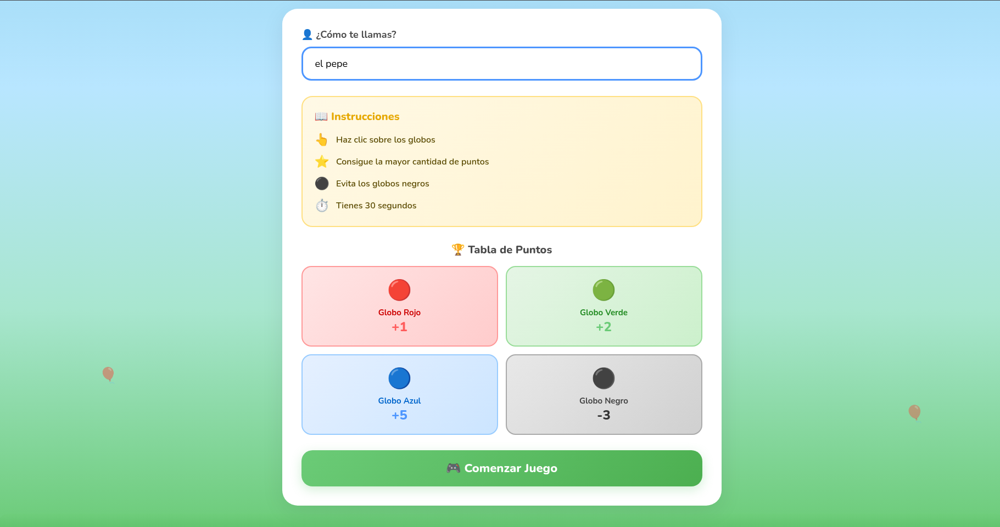
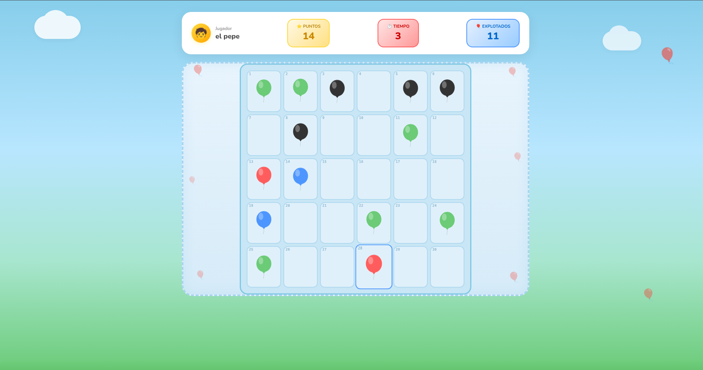
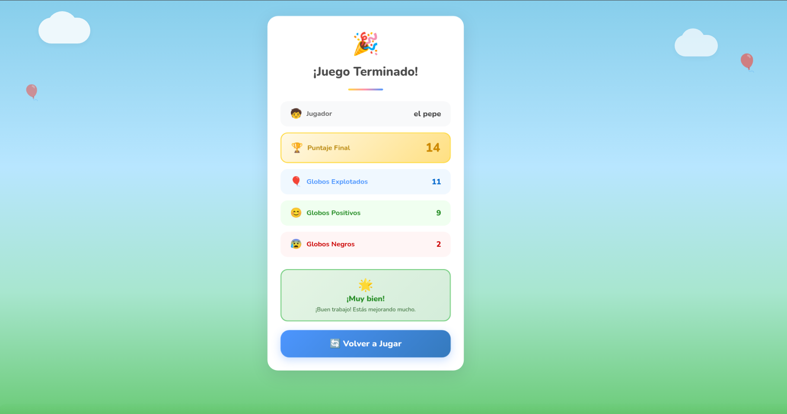

# 🎈 Explota los Globos

## Nombre del estudiante
Abner Esau Lopez Costop 

## Descripción del juego

**Explota los Globos** es un mini-juego hecho en React donde el jugador debe hacer clic sobre los globos que van apareciendo en un tablero de 30 celdas antes de que se acabe el tiempo (30 segundos).

Cada tipo de globo otorga una cantidad distinta de puntos:

| Globo | Puntos |
|---|---|
| 🔴 Rojo | +1 |
| 🟢 Verde | +2 |
| 🔵 Azul | +5 |
| ⚫ Negro | -3 |

El juego tiene 3 pantallas:
1. **Pantalla de Inicio**: el jugador ingresa su nombre y ve las instrucciones y la tabla de puntos.
2. **Pantalla de Juego**: se muestra el tablero, el cronómetro, el puntaje y la cantidad de globos explotados en tiempo real.
3. **Pantalla de Resultados**: al terminar el tiempo, se muestra un resumen final con el puntaje total, globos explotados, globos positivos/negativos y un mensaje según el rendimiento del jugador.

## Instrucciones para ejecutar el proyecto

```bash
# Clonar o descargar el repositorio
git clone git@github.com:fordlopez/juego-react-globos.git
cd juego-react-globos

# Instalar dependencias
npm install

# Ejecutar en modo desarrollo
npm run dev
```

Luego abre en el navegador la URL que indique la terminal (por defecto `http://localhost:5173`).

## Ejecutar con GitHub Pages
abre en el navegador y escribe la URL `https://fordlopez.github.io/juego-react-globos/`

## Conceptos de React utilizados

- **Componentes funcionales** (`PantallaInicio`, `PantallaJuego`, `PantallaFinal`, `TableroJuego`, `GlabosIntividuales`).
- **Hooks**: `useState` para manejar el estado del juego (tiempo, puntos, nombre, globos en pantalla, etc.), `useEffect` para controlar los temporizadores del juego, y `useRef` para mantener un contador persistente entre renders sin causar re-renderizados.
- **Renderizado condicional** para alternar entre las 3 pantallas del juego (`{pantallaIniciar && <PantallaInicio />}`, etc.).
- **Listas y `key` props** al recorrer el arreglo de celdas del tablero con `.map()`.
- **Props** para pasar datos del padre (`TableroJuego`) al hijo (`GlabosIntividuales`).
- **Eventos** (`onClick`, `onChange`) para manejar la interacción del jugador con los globos y el campo de nombre.

## Explicación breve del uso de Context API

Todo el estado global del juego (tiempo, puntos, nombre del jugador, globos en pantalla, pantalla actual, etc.) se maneja mediante `createContext` y un componente `GloboProvider` en `GloboContex.jsx`.

Este provider envuelve toda la aplicación desde `main.jsx`, por lo que **cualquier componente** (`PantallaInicio`, `PantallaJuego`, `PantallaFinal`, `TableroJuego`) puede acceder o modificar el estado del juego usando `useContext(GloboContext)`, sin necesidad de pasar props manualmente entre componentes (evitando el "prop drilling"). Ahí también viven las funciones que modifican el estado, como `botonIniciar`, `botonExplotar`, `sumarPuntos` y `botonReiniciar`.

## Dificultad principal encontrada

El problema más importante fue que **el cronómetro dejaba de actualizarse** (se quedaba pegado en un número, por ejemplo en 3) en lugar de bajar hasta 0 y terminar la partida correctamente.

## Explicación de cómo se resolvió esa dificultad

El juego usa tres `setInterval` dentro de un mismo `useEffect`: uno para el cronómetro, uno para generar globos nuevos y uno para eliminar el globo más antiguo. En la función de limpieza (`return`) del `useEffect` solo se estaban limpiando dos de los tres intervalos (`clearInterval(intervalo)` y `clearInterval(generarGlobos)`), **faltaba `clearInterval(eliminarGlobos)`**.

Al no limpiarse ese intervalo correctamente, cada vez que el efecto se volvía a ejecutar (por ejemplo, al reiniciar la partida) quedaban temporizadores "fantasma" corriendo en segundo plano, compitiendo entre sí y provocando que el estado del tiempo se comportara de forma inconsistente.

La solución fue agregar el `clearInterval` faltante en el cleanup del `useEffect`:

```javascript
return () => {
    clearInterval(intervalo);
    clearInterval(generarGlobos);
    clearInterval(eliminarGlobos); // <- intervalo que faltaba limpiar
};
```

Con este cambio, cada vez que el componente se re-renderiza o se desmonta, los tres intervalos se limpian correctamente y no quedan duplicados corriendo al mismo tiempo.


### Pantalla inicial


### Partida activa



### Pantalla de resultados


